# Open Science

## Contexte

{width=60%}

## C'est quoi ? 
 
Recherche reproductible 
 

données + méta-données + matériel & méthodes

## Pourquoi on en parle ?

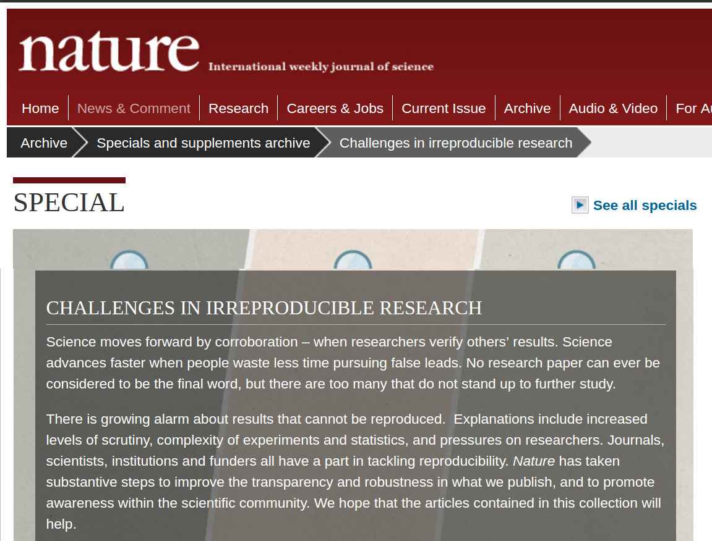{width=80%}

## Pourquoi on en parle ?

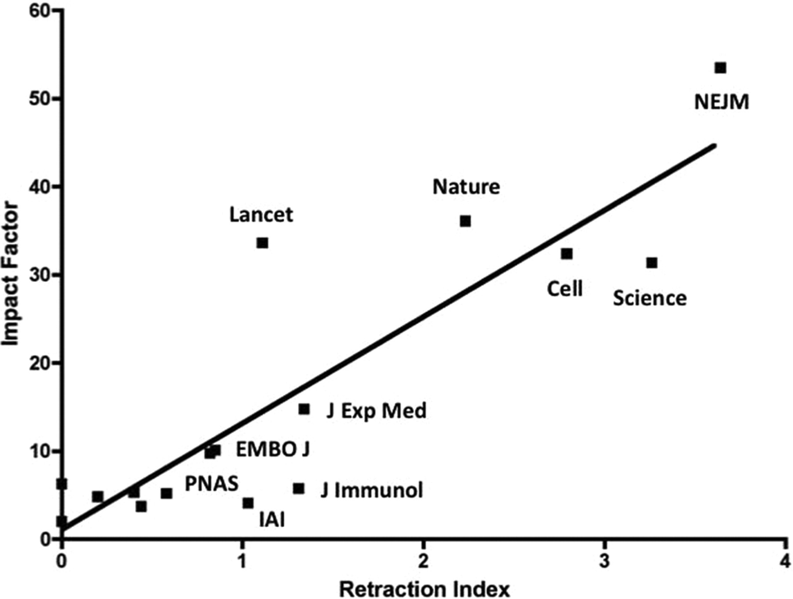{width=60%}

Ferric C. Fang, and Arturo Casadevall Infect. Immun. 2011;79:3855-3859

## Comment ?

Un article publié n'est que le sommet de l'iceberg que représente le processus de recherche.

> - Data Management: sauvegarde des données brutes et intermédiaires, tout documenter
pas, créer des données bien rangées pouvant être analysées

> - Software: écrire, organiser et partager ses scripts et programmes utilisés dans l'analyse

> - Tracking Changes: répertorier la façon dont les divers composants de votre projet changent dans le temps

> - Collaboration: faciliter la compréhension des collaborateurs existants et nouveaux, et contribuer à un projet

> - Project Organization: organiser les artefacts numériques d'un projet pour faciliter
découverte et compréhension

> - Manuscripts: écrire des manuscrits d'une manière qui laisse une piste d'audit et
minimise la fusion manuelle des conflits

Wilson et al. 2016. Plos Comp Biol. https://arxiv.org/pdf/1609.00037.pdf

## Comment ?

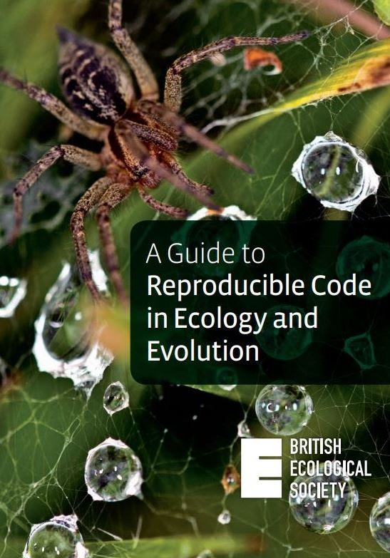{width=20%}

https://www.britishecologicalsociety.org/publications/guides-to/

https://www.britishecologicalsociety.org/wp-content/uploads/2017/12/guide-to-reproducible-code.pdf

## Data Management

 

> - Sauvegarder les données initiales en l'état (ne pas les modifier) et les mettre en lecture seule si possible

 

> - Scripter l'acquisition des données au maximum (API), surtout si elles sont volumineuses (ne plus cliquer mais coder)

 

> - Toute transformation sera scriptée = devient un résultat (80% du job)

 

> - Générer les données que vous voudriez recevoir, pouvant être lues par tous (noms de colonnes explicites, en anglais, conventions, tidy)

## Software

Le code, les scripts

> - Respecter au maximum les conventions de code de votre communauté, https://style.tidyverse.org/ (stylisation du code très détaillée) et peu importe la convention adoptée, rester constant !

 

> - Chemins relatifs ! Toujours ! (Répertoire de projet R à privilégier)

 

> - Pas d'espaces, d'accents dans les noms !

 

> - Commenter/documenter les fonctions, les scripts (pensez à vous même dans 6 mois)

## Software

L'environnement logiciel.

 

> - Les packages (version) : packrat (noms des fonction peuvent changer, sauvegarder le package dans la version utilisée)

 

> - Bibliothèques système, de la version de R, de la version de l'OS ?!

 

> - Docker (Rocker pour R), permet de créer une image de l'environnement de travail (OS, bibliothèques, R, packages) (https://colinfay.me/docker-r-reproducibility/ ; https://journal.r-project.org/archive/2017/RJ-2017-065/RJ-2017-065.pdf)

## Software

Le "workflow" (echaînement des scripts, des logiciels).

D'une manière générale automatiser au maximum

## Software

> - il existe des outils pour ça (pseudo makefile en R, makefile shell, pipeline toolkits [Remake, Drake])

 

> - Automatiser du script à la rédaction de l'article (Rmarkdown)

 

> - Gère tout seul les dépendances entre scripts et données car cela est automatisé (le summum hein)

## Tracking Changes

Utiliser un logiciel de gestion de versions (Git)

## Collaboration

 

> - Conventions de code (variable sans majuscule, sans espace..)

 

> - Documentaiton de l'archive de recherche (Readme, License, code de contribution, avoir tout au même endroit c'est mieux : research compendium)

 

> - Plateforme de collaboration en ligne (intègre Git !) : github, gitlab

## Project Organization

 

## Project Organization

 

> - Research compendium : organisation du répertoire de travail

 

> - Pipeline toolkit (Drake) : gère les dépendances entre données, scripts et résultats (summum de l'Open Science mais nécessite une habitude de coder en fonction)

## Manuscripts

 

Utiliser la programmation lettrée (literate programming)

 

<blockquote> au lieu de considérer que notre tâche principale est de dire à un ordinateur ce qu'il doit faire, appliquons-nous plutôt à expliquer à des êtres humains ce que nous voulons que l'ordinateur fasse.
</blockquote>

Donald Knuth, années 70

## Manuscripts

Rmarkdown (https://rmarkdown.rstudio.com/)

## Manuscripts

## Manuscripts

 
 

Comment ça marche Rmarkdown ?

En markdown le texte est formaté en utilisant des balises très simples comme les _ ou les *

Aide mémoire très détaillée : https://nicolascasajus.fr/mastering-markdown/#1

## Manuscripts

Formats d'export de Rmarkdown (pandoc)

{width=50%}

## Manuscripts

Faire ses slides avec Rmarkdown

https://arm.rbind.io/slides/xaringan.html#1

https://rmarkdown.rstudio.com/lesson-11.html

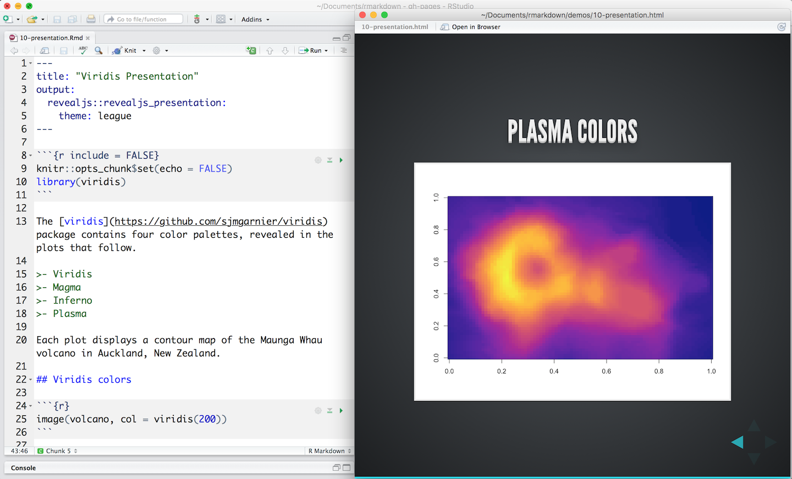{width=50%}

## Manuscripts

Pensez également aux graphs et figures ! 

https://www.data-to-viz.com/

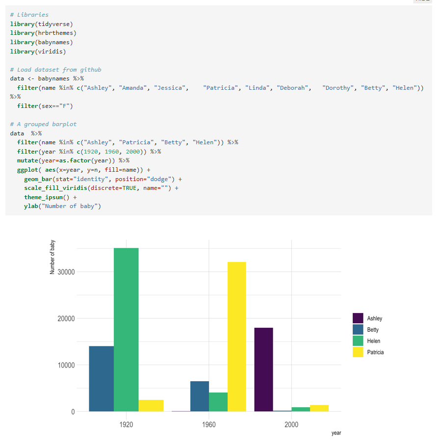{width=50%}

Yann Holtz & Conor Healy, 2018

# Versioning your code

## Introduction à Git 

{width=50%}

## Introduction à Git 

https://github.com/ewenme/ghibli

{width=50%}

## Introduction à Git 

Suivre les changements dans un projet : 

> - Collecte de données: "Carnet de laboratoire"
> - Analyse des données: Versioning
> - Rédaction d'article: Versioning

## Introduction à Git 

Il existe de nombreux outils pour le suivi de version, `git` est un des plus utilisés. Il prends des **snapshot** (commits) de l'avancement de votre projet et permet de :

> - Archiver et avoir un historique des changements
> - Faire des retour en arrière
> - Avoir différentes versions (branches)
> - Développement collaboratif

## Introduction à Git  

Quelques définitions :

> - **Repository/Dépôt**: un répertoire comprenant un répertoire `.git` (dossier caché)
> - **Commit**: un instantané du répertoire (une date, un auteur, une description, un commit parenté *t-1*)
> - **Dossier de travail**: une version des fichiers du référentiel sur votre ordinateur
> - **Index**: un espace temporaire incluant les modifications à engager

## Starting with git 

Toutes les commandes suivent le même pattern :

`git commande texte`

> - `mkir nom_dossier` créer un répertoire  dans l'ordinateur 
> -  `git init`  créer un répertoire git
> - `git status` checker le statut du répertoire
> - `git add fichier` ajouter un fichier sous contrôle de version
> - `git commit -a -m "message informatif"` prendre un instantannée (-a = all, faire le même commit pour tous les fichier)
> - `git log` voir l'historique des commit
> - `git show identifiant du commit` voir ancienne version d'un fichier

## Configuration de git 

`git config global -- "adresse mail"`
`git config user "Prénom Nom"`

Quelques tuto : 

> - https://informatique-mia.inrae.fr/r4ciam/sites/default/files/download/tutoriels/UtilisationGit13mai.pdf
> - https://www.atlassian.com/git/tutorials/install-git
> - https://cfss.uchicago.edu/setup/git/
> - https://cfss.uchicago.edu/setup/git-with-rstudio/
> - http://r-pkgs.had.co.nz/git.html

## Les 3 espaces de git 

> - Working directory : dossier de travail avec les fichiers
> - Commit graph: dépôt/espace de stockage des commits
> - Index: espace entre les deux, fichiers indexés mais pas encore "pushés"

## Déplacement dans ces 3 espaces de travail

> - `git add` ajouter les modifications à l'index
> - `git commit` construire un commit dans l'index
> - `git diff` montre les différences entre le fichier dans le working directory et l'index
> - `git checkout` mets à jour le working directory avec le répertoire
> - `git reset HEAD` retire le dernier changement fait à l'index

## Utiliser un serveur distant : Github ou Gitlab

Pourquoi utiliser un serveur distant:

> - Une sauvegarde de votre référentiel
> - Travailler avec les autres
> - Augmentez votre visibilité
> - Augmentez les interactions avec les utilisateurs
> - Distribution facile des versions devel

## Travailler avec un serveur distant 

> - `git clone URL` créer une copie indépendante du répertoire
> - `git pull` récupérer le contenu distant
> - `git push` déposer les modifications locales sur le répertoire distant

## Travailler avec un serveur distant 

Toujour puller avant de pusher, pour avoir toujours la dernière version ! 

Organisation et communication pour éviter les conflit de commits

## Commit graph et branches

- La principale caractéristique des branches est de permettre de basculer entre les différentes versions très facilement
- Une branche doit correspondre à un sujet, par ex. une correction de bug, une nouvelle fonctionnalité, etc.
- Particulièrement utile lorsque vous ne savez pas quand / si certaines modifications seront incluses (c'est-à-dire très souvent)
- Il permet plusieurs processus de développement simultanés

## Comprendre les branches

https://leargitbranching.js.org/

## Contrôle de version

Un bon résumé des commandes `git` :

https://github.github.com/training-kit/downloads/fr/github-git-cheat-sheet.pdf

Cette partie est fortement inspirée de la formation de Philippe Veber (LBBE) et de Stéphane Dray (LBBE)

# Research compendium

## Research compendium

Où comment bien ranger sa chambre pour retrouver ses jouets

## Késako 

- Un receuil qui synthétise de manière exhaustive votre projet d'analyse de données

- Quelques règles simples pour organiser son répertoire de travail

- Et pouvoir s'y retrouver et que les autres s'y retrouvent (ou soi même dans 6 mois, 1an)

- Aujourd'hui on partage son code, ses données, ses résultats avec ses encadrants, collègues ou le reste du monde

- Autant se préparer depuis le début plutôt que de devoir tout refaire ou risquer la honte internationale !

## Principes

> - Adopter les conventions du domaine (e.g. en anglais, sans accent, sans espace, sans majuscule)
> - Séparer les répertoires de projet 
>  - **data** : input, données brutes (on ne les modifie jamais!)
>  - **scripts** : la méthode, les fichiers R que l'on écrit
>  - **results** : les figures, les données modifiées
>  - **(docs)** : documentation liée au projet
>  - **(manuscripts)** : articles, thèses, mémoire

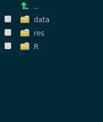

## Principes

- Les flux d'analyse sont séparés en étapes courtes et homogènes
- Un script = une étape
- Sourcer les fichier et nettoyer l'espace de travail régulièrement (`rm(list=ls())`) 

## Principes

- Numéroter les scripts et placez des entêtes

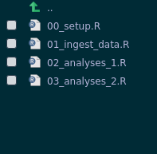{width=20%}
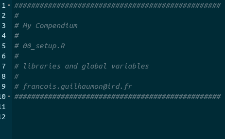{width=50%}

## Principes

- Utiliser un script maître à la racine

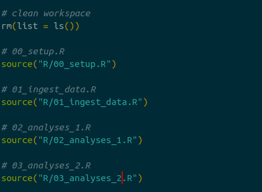{width=20%}
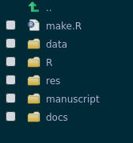{width=50%}

## Principes

- Tous les scripts tournent à partir de la racine du projet (`setwd`est banni, sinon au bûcher)
- Chaque script est associé à un répértoire de résultat qui porte le nom du script

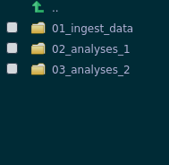{width=50%}

## Principes

- `00_setup.R` : permet de faire tourner toutes les librairies (packages) nécessaire
- Placer des entêtes
- Créer automatiques des dossiers pour chaques codes R
- Utiliser les file paths
- Placer un README à la racine du projet

## Références

- Marwick B, Boettiger C, Mullen L. 2018. Packaging data analytical work reproducibly using R (and friends). PeerJ Preprints 6:e3192v2 https://doi.org/10.7287/peerj.preprints.3192v2
- https://research-compendium.science/
- https://zenodo.org/communities/research-compendium/about/
- https://github.com/cboettig/template (structure de package)
- https://github.com/benmarwick/rrtools (structure de apckage + intégration docker !!)

# Acquisition des données et webscraping

# Tidyverse et autres packages trop cools

