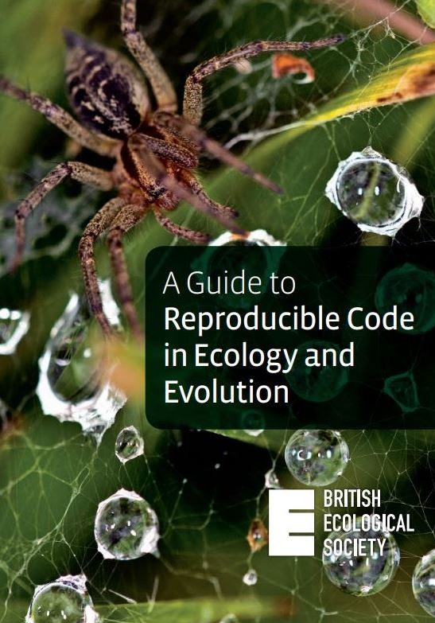
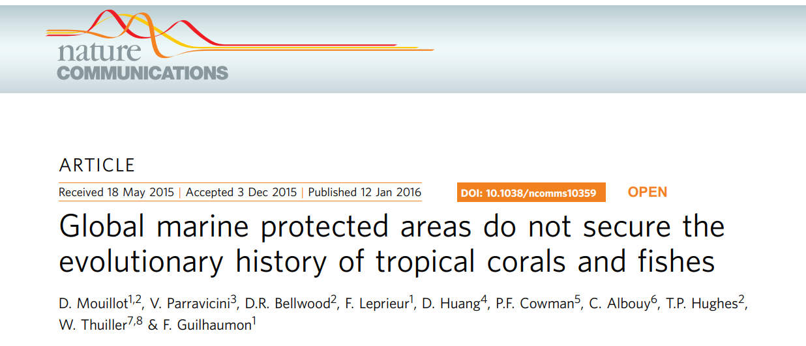
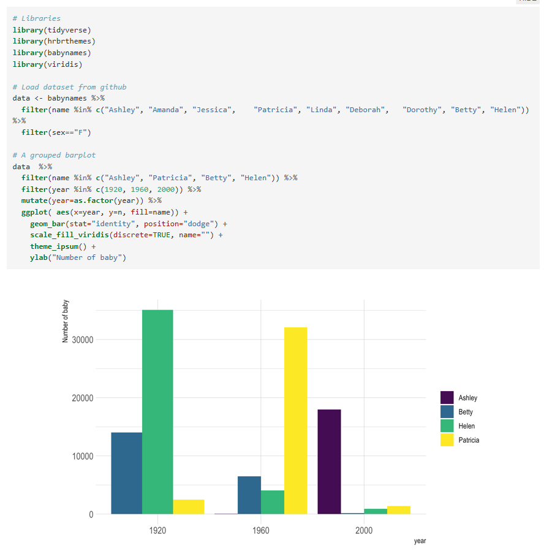

# Open Science

## Contexte

{width=60%}

## C'est quoi ? 
 
Recherche reproductible 
 

données + méta-données + matériel & méthodes

## Pourquoi on en parle ?

{width=80%}

## Pourquoi on en parle ?

{width=60%}

Ferric C. Fang, and Arturo Casadevall Infect. Immun. 2011;79:3855-3859

## Comment ?

Un article publié n'est que le sommet de l'iceberg que représente le processus de recherche.

> - Data Management: sauvegarde des données brutes et intermédiaires, tout documenter
pas, créer des données bien rangées pouvant être analysées

> - Software: écrire, organiser et partager ses scripts et programmes utilisés dans l'analyse

> - Tracking Changes: répertorier la façon dont les divers composants de votre projet changent dans le temps

> - Collaboration: faciliter la compréhension des collaborateurs existants et nouveaux, et contribuer à un projet

> - Project Organization: organiser les artefacts numériques d'un projet pour faciliter
découverte et compréhension

> - Manuscripts: écrire des manuscrits d'une manière qui laisse une piste d'audit et
minimise la fusion manuelle des conflits

Wilson et al. 2016. Plos Comp Biol. https://arxiv.org/pdf/1609.00037.pdf

## Comment ?

{width=20%}

https://www.britishecologicalsociety.org/publications/guides-to/

https://www.britishecologicalsociety.org/wp-content/uploads/2017/12/guide-to-reproducible-code.pdf

## Data Management

 

> - Sauvegarder les données initiales en l'état (ne pas les modifier) et les mettre en lecture seule si possible

 

> - Scripter l'acquisition des données au maximum (API), surtout si elles sont volumineuses (ne plus cliquer mais coder)

 

> - Toute transformation sera scriptée = devient un résultat (80% du job)

 

> - Générer les données que vous voudriez recevoir, pouvant être lues par tous (noms de colonnes explicites, en anglais, conventions, tidy)

## Software

Le code, les scripts

> - Respecter au maximum les conventions de code de votre communauté, https://style.tidyverse.org/ (stylisation du code très détaillée) et peu importe la convention adoptée, rester constant !

 

> - Chemins relatifs ! Toujours ! (Répertoire de projet R à privilégier)

 

> - Pas d'espaces, d'accents dans les noms !

 

> - Commenter/documenter les fonctions, les scripts (pensez à vous même dans 6 mois)

## Software

L'environnement logiciel.

 

> - Les packages (version) : packrat (noms des fonction peuvent changer, sauvegarder le package dans la version utilisée)

 

> - Bibliothèques système, de la version de R, de la version de l'OS ?!

 

> - Docker (Rocker pour R), permet de créer une image de l'environnement de travail (OS, bibliothèques, R, packages) (https://colinfay.me/docker-r-reproducibility/ ; https://journal.r-project.org/archive/2017/RJ-2017-065/RJ-2017-065.pdf)

## Software

Le "workflow" (echaînement des scripts, des logiciels).

D'une manière générale automatiser au maximum

## Software

> - il existe des outils pour ça (pseudo makefile en R, makefile shell, pipeline toolkits [Remake, Drake])

 

> - Automatiser du script à la rédaction de l'article (Rmarkdown)

 

> - Gère tout seul les dépendances entre scripts et données car cela est automatisé (le summum hein)

## Tracking Changes

Utiliser un logiciel de gestion de versions (Git)

## Collaboration

 

> - Conventions de code (variable sans majuscule, sans espace..)

 

> - Documentaiton de l'archive de recherche (Readme, License, code de contribution, avoir tout au même endroit c'est mieux : research compendium)

 

> - Plateforme de collaboration en ligne (intègre Git !) : github, gitlab

## Project Organization

 

## Project Organization

 

> - Research compendium : organisation du répertoire de travail

 

> - Pipeline toolkit (Drake) : gère les dépendances entre données, scripts et résultats (summum de l'Open Science mais nécessite une habitude de coder en fonction)

## Manuscripts

 

Utiliser la programmation lettrée (literate programming)

 

<blockquote> au lieu de considérer que notre tâche principale est de dire à un ordinateur ce qu'il doit faire, appliquons-nous plutôt à expliquer à des êtres humains ce que nous voulons que l'ordinateur fasse.
</blockquote>

Donald Knuth, années 70

## Manuscripts

Rmarkdown (https://rmarkdown.rstudio.com/)

## Manuscripts

## Manuscripts

 
 

Comment ça marche Rmarkdown ?

En markdown le texte est formaté en utilisant des balises très simples comme les _ ou les *

Aide mémoire très détaillée : https://nicolascasajus.fr/mastering-markdown/#1

## Manuscripts

Formats d'export de Rmarkdown (pandoc)

{width=50%}

## Manuscripts

Pensez également aux graphs et figure ! 

https://www.data-to-viz.com/

{width=50%}

Yann Holtz & Conor Healy, 2018

# Versioning your code

## Introduction à Git 

# Research compendium

# Acquisition des données et webscraping

# Tidyverse et autres packages trop cools

# Les données spatiales

