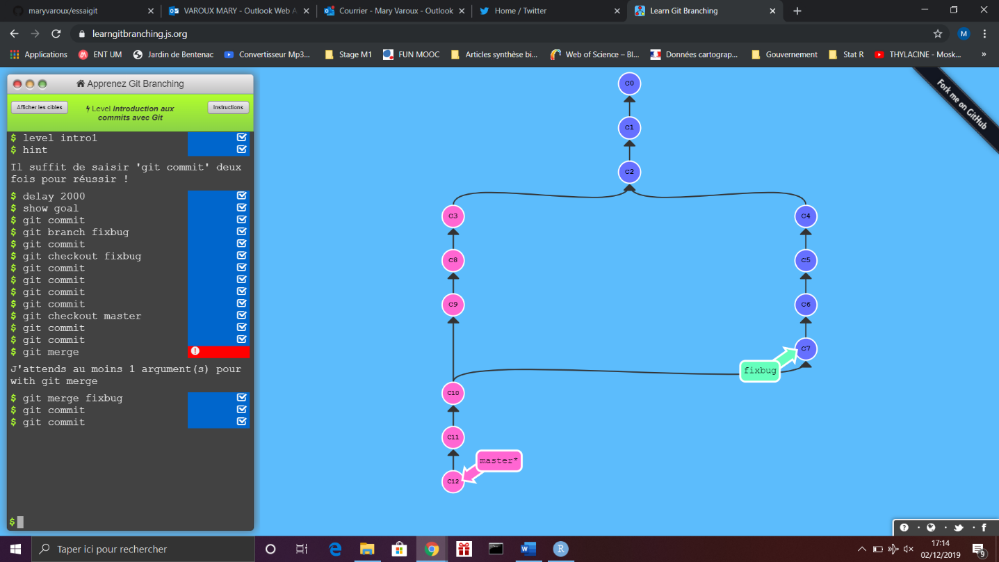
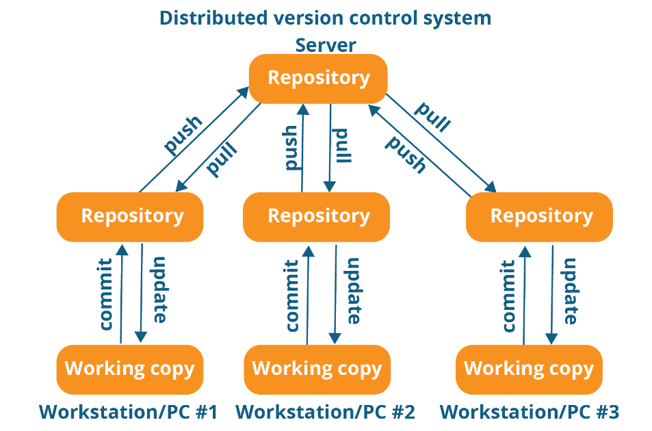
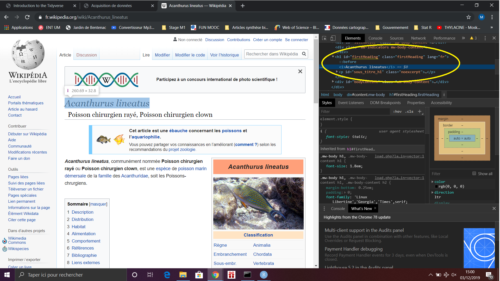

```{r setup, include=FALSE}
knitr::opts_chunk$set(echo = TRUE)
```

## Lundi 2 Décembre

# 1. OPEN SCIENCE (SCIENCE REPRODUCTIBLE) `r emo::ji("boom")`
*François Guilhaumon, IRD MARBEC*

*C’est quoi ?* Exemple de Galilé avec données (dessins), métadonnées (date, météo, caractéristique lunette) et matériel et méthodes. C’est une recherche qui est diffusable avec données + métadonnées + matériel et méthodes.

*Pourquoi ?* C’est la base de la recherche de pouvoir être évaluer par ses pairs et permettre aux autres de construire sur la base déjà construite. Numéro spécial dans Nature, notamment ces derniers temps. Taux de retractation et impact factor du journal : forte corrélation positive → fraude scientifique ? Dans 40% des cas erreur honnête ou données non replicables, recherche non reconduites, publication redondantes ou autres raisons.

*Pourquoi on en parle ?* Publiez vos codes et données. Impact sur les société et les politiques publiques.

*Comment ?* Un article publié n’est que le sommet de l’iceberg que représente tout le processus de recherche. Exposé aux autres beaucoup plus que la partie finale (i.e. l’article rédigé) :

-	**Data management**
-	**Software** : gérer les logiciels
-	**Tracking changes** : étudié changement fichiers, codes au cours du temps
-	**Collaboration**
-	**Project organization** : organisation physique du répertoire dans l’ordinateur
-	**Manuscripts** : automatisation des insertions des figures et tableaux

(Wilson *et al*. 2016 Plos.One)

## 1.1. Data management 

- Sauvegarder les données initiales en état
-	Mettre en lecture seule si possible
-	**Scripter l’acquisition des données au maximum (API)**, surtout si elles sont volumineuses (essayer de ne plus cliquer mais de tout coder)
-	Toute transformation sera scripté et sera considérée comme une résultat (80% de notre travail)
-	Générer des fichiers de données pouvant être lues par tout le monde (noms de colonnes explicites, respect des conventions, tidy)

## 1.2. Software

Ecrire, organiser et partager son travail (script, programme)

### 1.2.1. Les codes, les scripts 

-	Respecter au maximum les conventions : [The tidyverse style guide](https://style.tidyverse.org/) (conseils pour la stylisation du code très détaillés)
-	Rester constant dans la convention adoptée à travers ce projet (exemple : choix de nom de variable sans majuscule, respecter cela pendant tout le projet)
-	**Chemin relatif** (répertoire de travail du projet R, toujours à privilégier) VS chemin absolu (part de la racine jusqu’à notre fichier)
-	Pas d’espace, pas d’accent dans les noms ! 
-	Commenter/documents ses scripts, ses fonctions (penser à nous même plus tard, notre plus proche collaborateur dans 6 mois ou 1an) (fonction : ce qu’elle prends, ce qu’elle sort ect..)

### 1.2.2. L’environnement logiciel

- **Les packages (version)** : *packrat*, les noms des fonctions peuvent changer ou la fonction en elle-même peut changer. Il faut sauvegarder le package dans la version dans laquelle les fonctions et packages ont été utilisés.
-	**Bibliothèque système* : de la version de R ou de notre OS. Les packages R s’appuient sur les librairies systèmes. 
-	**Docker** : permet de créer une imagin de l’environnement de travail (OS, bibliothèque, R, package). Il permet de créer des machines virtuelles à l’intérieur de votre ordinateur. C’est le summum de la recherche reproductible ! (Basé sur du linux mais marche sur R de manière non spécifique) 
-	**Workflow** : enchaînement des scripts, des logiciels, d’une manière générale automatiser au maximum. Il existe des outils pour ça (pseudo makefile en R, makefile shell pipeline toolkits ([*Remarke*, *Drake*] : automatiser tout ça du script jusqu’à la rédaction de l’article). Gère tout seul les dépendances entre scripts et données car cela est automatisé. 

## 1.3. Tracking changes

Utiliser un logiciel de gestion de version (Git).

## 1.4. Collaboration

-	Utiliser des conventions de code (variable sans majuscule, sans espace) 
  - Documentation de l’archive de recherche (e.g. répertoire de travail, avoir tout au même endroit pour un projet de recherche : données, scripts, recherche, résultats, articles, références) (Readme, License : quels droits pour ce code, code de contribution : fichier et pratique qui permet de contribuer)
  - Plateforme de collaboration en ligne qui intègre Git : Github, Gitlab

## 1.5. Project organization

Organiser les codes pour qu’ils soient compréhensibles, lisibles et reproductibles. Il faut faire attention à l’organisation de son répertoire de recherche. 

-	**Research compendium** : organisation du répertoire de travail, organiser et respecter vous, numérotation des scripts
-	**Pipeline toolkit (Drake)** : gère les dépendances entre données, scripts et résultats. Quels scripts est liés à tel jeu de données ?

## 1.6. Manuscripts

Le principe existe depuis longtemps, il faut utiliser la programmation lettrée. Il faut considérer notre tâche comme être capable d’expliquer à l’autre être humain ce qu’on a demander à l’ordinateur. Il faut entremeler à notre code des informations écrites (commentaires) mais également des outils pour implémenter ce concept à la rédaction de l’article (dans R Studio oui oui !). 
Rmarkdown (fichier rmd) qui mélange du script et du texte : fichier avec entête avec formation de sortie, paragraphe avec du code R, du texte et formater notre texte avec des balises très simples. 
Fichier .rm > lu par un package knitr > transformé en fichier .md (sans code) > pandoc permet d’exporter ce fichier sous plusieurs formations > word, excel, pdf, html, latex… 
La recherche reproductible c’est tout d’abord se rendre service à soi-même.

*(Maintenant cloner le répertoire git datatoolbox dans RStudio ou utiliser gitclone)*

# 2.	VERSIONING YOUR CODE (AND MORE) `r emo::ji("panda_face")`

Introduction à Git en ligne de commande puis avec R Studio. 

## 2.1.	Introduction

Quand on fait de la science, c’est comme gravir une montagne et le bonheur ce n’est pas quand on est tout en haut mais de grimper, Confucius. On va essayer de mettre des balises pour pouvoir refaire le chemin. 
Il existe différentes étapes en science qui sont logiques et linéaires, même si en pratique la démarche est assez longue. L’idée est d’avoir un historique, un suivi, de lorsqu’on fait de la recherche. Avec différentes étapes, comment je peux en garder une trace ? 

Track the changes in a project : 

-	**Data gathering** : lab notebook
-	**Data analysis** : versioning
-	**Article writing** : versioning

Il faut pouvoir répondre au 5W en anglais : qui, quoi, pourquoi, où, à quel moment ? Grâce aux commits on a un suivi temporel qui nous permet de répondre à toutes ces questions, cela permet de conceptualiser tous les changements effectués sur une information.

## 2.2.	Git 

Git est l’outil le plus utilisé. C’est un programme qui prend des snapshot = commits, et c’est cela qui peut donner le contexte. On peut comparer deux commits et voir ce qui a changé. On va pouvoir naviguer dans ces commits et obtenir des informations très utilise dans le développement de logiciel ou l’écriture d’articles :

-	Archivage des étapes donc un historique
-	Retour en arrière
-	Différentes versions = branches, permet de développer plusieurs parties du logiciel en même temps
-	Développement collaboratif
-	Backup (utilisation de serveurs externes)

C’est également très utile pour publier des suppléments, des appendixs, pour avoir un suivi de codes, les données et les scripts qui utilisent les données. 

### 2.2.1.	Quelques définitions

-	**Repository/Dépôt** : dépôt .git qui permet de déposer ses fichiers, dossier caché qui n’est pas forcément affiché et qui contient toutes les informations liées au versioning
-	**Commit** : photo de notre dossier à un instant t : date, personne, description du changement, changement apporté (insertion, délétion) et lien de parenté (commit t-1)
-	**Working copy/Dossier de travail** : ensemble de nos fichiers sur l’ordinateur
-	**Index** : espace temporaire qui se situe entre le dépôt et la copie de travail

Pour le dépôt git on commence toujours par des commandes git quelque chose.

### 2.2.2.	Starting with git 


```
C:\Users\Asus\> cd Desktop\
C:\Users\Asus\Desktop\> mkdir essaigit\
C:\Users\Asus\Desktop\essaigit\> git init #initialize folder to versioning
# Initialized empty Git repository in C:/Users/Asus/Desktop/essaigit/.git/
C:\Users\Asus\Desktop\essaigit>dir /A:H
# Le volume dans le lecteur C s’appelle OS
# Le numéro de série du volume est B24A-DEE1
# 
# Répertoire de C:\Users\Asus\Desktop\essaigit
# 
# 02/12/2019  12:01    <DIR>          .git
# 0 fichier(s)                0 octets
# 1 Rép(s)  178 088 546 304 octets libres
C:\Users\Asus\Desktop\essaigit>git status
# On branch master
# 
# No commits yet
# 
# nothing to commit (create/copy files and use "git add" to track)
C:\Users\Asus\Desktop\essaigit>git add test.txt
C:\Users\Asus\Desktop\essaigit>git status
C:\Users\Asus\Desktop\essaigit>git commit -a -m "premier fichier" #-all pour all
C:\Users\Asus\Desktop\essaigit>git commit -m "premier fichier" test.txt #-ajouter nom du fichier à la fin si que -m
#penser à
#penser à faire le git config --global "mary.varoux@etu.umontpellier.fr"
#git config --global user "Mary Varoux"
#décrire l'action moins de 80 caractères
#-a = all 
C:\Users\Asus\Desktop\essaigit>git log
#donne différente photo fait sur le dépot
# commit dbf58523f767d7df61b1b8f43be7bd3701edc0e5 (HEAD -> master)
# Author: Mary Varoux <mary.varoux@etu.umontpellier.fr>
#   Date:   Mon Dec 2 12:18:02 2019 +0100
# 
# premier fichier
C:\Users\Asus\Desktop\essaigit>git log -p #pour voir les modificiations faites
C:\Users\Asus\Desktop\essaigit>git show dbf58 test.txt #afficher commit avec début chaîne caractère
Q #quitter si [END]
```


[Aide-mémoire git](https://github.github.com/training-kit/downloads/fr/github-git-cheat-sheet.pdf)


## 2.3.	The 3 areas of git

Il existe 3 espaces dans git pour le suivi de version : 
-	**Working directory** : dossier de travail avec les fichiers
-	**Commit graph** : espace des commit, c’est le dépôt à proprement dit, c’est là qu’est stocké les commits (snapshots)
-	**Index** : espace entre les deux, seulement les fichiers indexés qui seront pris en compte si on fait un commit, permet de sélectionner les fichiers où l’on veut faire un commit commun (exemple sur 10 : 5 sélectionnés pour commiter une chose a, et puis sélectionner les 5 autres pour commiter une chose 5). Quand on fait `git -add` on les place dans l’index, puis quand on commit ce sera sur ces même fichiers qui ont été indexés.

Si ajout d’un fichier (test3.txt) et modification du test2.txt :

```
C:\Users\Asus\Desktop\essaigit>git add test3.txt
C:\Users\Asus\Desktop\essaigit>git comit -m "ajout d’un nouveau fichier" test3.txt
C:\Users\Asus\Desktop\essaigit>git status
#on a uniquement commiter le test3 sans commiter la modification du test2
#On branch master
#Changes not staged for commit:
#  (use "git add <file>..." to update what will be committed)
#  (use "git restore <file>..." to discard changes in working directory)
#        modified:   test2.txt
#no changes added to commit (use "git add" and/or "git commit -a")
#On peut alors faire un commit sur la modification du test2.txt
#Cela revient au même que lorsqu’on sélectionner les fichiers à commiter
#On peut aussi commiter sur le même fichier deux commit en indexant les parties à commiter (chercher comment faire cela, c’est un état intermédiaire qui amène une certaine flexibilité)
```

## 2.4.	Using a distant server

-	Backup de notre répertoire
-	Travailler à plusieurs avec le suivi de version
-	Augmenter votre visibilité (dépend si c’est privé ou pas, gitlab du LBBE différent du github public)
-	Augmenter les interactions avec les utilisateurs
-	Distributions faciles des différentes versions


Il existe des gitlab académique (gitlab in2p3) ou bien privé (github). 

## 2.5.	Cloning a repo

La première chose à faire c’est de cloner le répertoire sur le copier sur notre machine. 

```
C:\Users\Asus\Desktop\essaigit>git clone https://github.com/FRBCesab/datatoolbox.git
C:\Users\Asus\Desktop\essaigit\datatoolbox>git log #permet de voir tous les commits effectués sur ce repo dans github
```

- **`.gitignore`** : l’ensemble des fichiers que l’on ne veut pas suivre 
- **`gitpull`** : récupérer le contenu distant et le mettre sur la machine
- **`gitpush`** : on prends ce que l’on a localement et on le met sur le dépôt

On ne peut pas pusher tant que l’on n’a pas puller ! Cela permet d’avoir toujours la dernière version à jour avant de modifier et d’envoyer ses commits !

Il faut être organiser et quand on travaille à plusieurs il faut communiquer car il peut y avoir des conflits au niveau des commits quand on modifier un fichier en même temps au même endroits, des pull et push. 

S’il y a un conflit :

```
<<<<<<< HEAD
Oiseaux
=======
Poissons
>>>>>>>>> dbf58523f767d7df61b1b8f43be7bd3701edc0e5
```

Sinon on fait : `git rester –soft HEAD~1`

Là il faut donc choisir ce que l’on garde, ici on choisit Oiseaux donc on supprime manuellement « Poissons ». Il suffit alors de commiter, pull puis push.

## 2.6.	Starting a new project on Github

Créer répertoire sur Github avec même nom du projet « essaigit »

```
C:\Users\Asus\Desktop\essaigit >git remote add origin https://github.com/maryvaroux/essaigit.git
C:\Users\Asus\Desktop\essaigit >git push -u origin master
```

Générer une clé SSH sur son ordinateur puis une clée public que l’on créer sur github selon deux manières :
-	Tools > Global Options > Git/SVN > SSH RSA key > view public key (chaîne de caractère à coller dans github)
-	`cd~\ puis ssh -keygen – t rsa`

Puis dans Github > Personnal settings > SSH and GPG keys puis SSH keys avec nom de clé si différentes clés utilisées (ex : ordi perso, ordi pro). 

Il faut faire attention si on a cloner le répertoire en SSH, car en HTTPS on nous demandera toujours notre mot de passe. Dans le cas du clonage avec SSH, en renseignant la clé, on ne demandera plus la clé SSH. 

## 2.7.	Dealing with branches

Les branches permettent de créer des développements parallèles ou pour différents utilisateurs qui sont des parties différentes du code puis de repusher ça après si cela marche sur la branche master.
Les commits que l’on fait sont en fait un réseau linéaire avec pour parent le commit précédent. Une branche représente et spécifie un commit particulier pour lequel le développement diverge. 

Démonstration : https://learngitbranching.js.org/

On va avoir deux branches dont la branche master et la nouvelle qui va permettre de fixer le beug. 
On peut bosser sur différente branche en même temps avec des **comit**. Par exemple, la branche master représente la branche qui fonctionne tandis qu’on essaye toujours de résoudre le beug sur la branche fixbug. 

Après on merge lorsque le problème est résolu ou que les utilisateurs ont terminé leur travail perso sur le code. Il faut savoir qu’après on peut supprimer la branche, mais les commit restent là. Ainsi, on ne pourrat plus distinguer les commits de la branche master des autres branches. On peut donc garder les branches. Sinon il existe aussi des packages implantés pour lisser le développement et obtenir quelque chose de plus linéaire : rebase. Ainsi, les commits auront désormais deux parents. 



Après on **merge** lorsque le problème est résolu ou que les utilisateurs ont terminé leur travail perso sur le code. Il faut savoir qu’après on peut supprimer la branche, mais les commit restent là. Ainsi, on ne pourrat plus distinguer les commits de la branche master des autres branches. On peut donc garder les branches. Sinon il existe aussi des packages implantés pour lisser le développement et obtenir quelque chose de plus linéaire : rebase. Ainsi, les commits auront désormais deux parents. 



Si on merge puis supprime une branche il faut bien penser à commiter sur la branche master avant. Il faut aussi toujours se mettre sur la branche master pour merge : `git merge fixbug` puis pour supprimer git branch -d fixbug``.

## Mardi 3 Décembre

# 3.	TRAVAIL COLLABORATIF

## 3.1. Why you should not use WORD (or ther WYSWYG editors)

En travaillant sur Word on n’a pas accès au différentiel sur Github. On peut cependant accéder aux différentes versions mais on ne voit pas apparaître les différences comme pour les scripts R ou Rmarkdown. Le Word est un fichier binaire avec le texte, la mise en forme, les figures et autre. Git sait gérer le versioning mais ne peut pas afficher les différences en lien avec ce type de formatage. C’est le problème de suivre des fichiers binaires en suivi de version. 

## 3.2. What we need

On a besoin d’un outil pour faire du suivi de version, qui peut nous permettre de mettre du texte, du code et des analyses, et qui soit à la fois dynamique, qui se mette à jour automatiquement. Pour résoudre cela on a le Literate programming (programmation lettrée). Le plus simple c’est d’intégrer les analyses et le texte dans un seul et même document. 

## 3.3. Literal programming

Dans un document de programmation lettrée on va avoir du texte pour les humains et du texte pour les machines qui va être intégré et interprété. Dans R, historiquement on avait Sweave (.Rnw) : Latex et R en sortie pdf ; puis on a Rmarkdown (.Rmd) : Markdown et R avec sortie pdf, html, word ect…

**Pandoc** est un convertisseur de fichier universel. 

**Antisèches** : https://nicolascasajus.fr/mastering-markdown/#1

**Mise en page possible en CSS** avec différents styles de polices. On peut définir un ensemble de style sous un format mystyle.css

**Code chunks** :
- Eval = FALSE : afficher sans faire tourner
- Echo : affiche le code
- Result : hide pas afficher résultat
- Cache : TRUE il va faire les calculs puis les résultats seront stocké dans un dossier

## 3.4. Slides

On va pouvoir écrire du markdown avec du texte et du code R qui va être interprété. C'est un fichier rmd, comme pour la programmation lettrée. A la racine on a le fichier rmd qu'on appelle souvent index, puis après on a le cache pour recompiler le fichier html rapidement. Il faut également faire un dossier image, style css. 

Mise en page avec le **package xaringan** : 

- mettre dans la date ce style : "`r format(Sys.time(), '%A %d %B %Y')`"
- nature : autres options (format slide ect..)
- style : automatiques

Si on fait trois tirets on commence une nouvelle slide `---`.

Xaringan a des css prédéfinies pour centrer les images, pull-left/pull-right on peut compartimenter nos slides. Si on ne veut pas afficher le code on peut modifier pour les codes R en mettant echo = FALSE. Si on l'afficher globale ou locale on peut modifier selon les différents chunks. On peut aussi faire plusieurs chunks avec les mêmes paramètres. 

Le package utilisé pour les slides de la formation est *xaringanthemer*. Il propose différent thème. 

On peut importer des figures dans le Rmark avec un chunck `{r child = "ggplot.Rmd"}` ainsi que des fonctions R en sourcant les scripts. On peut aussi intégrer des images, des gif, des cartes `mapview::mapview()`, `sf::st_read(dsn= ..., layer = "occitanie")` avec les shapefiles associés. 


# 4.	ACQUISITION DE DONNEES : API ET WEBSCAPING

**API** : Interface de programmation pour application
**Protocole HTTPS** : affichage d'une page web

Les API du site permet de faire l'interface entre le serveur et l'utilisateur sans passer par internet. L'intérêt de l'utilisation des API c'est l'automatisation et la reproductibilité, associé à un dépot Git. Les API permet de récupérer sous R des données d'autres formats de données (xml, (geo)json, yaml, texte, ect...). 

## 4.1. Qu'est ce qu'une API ?  
- Il n'existe pas de protocole standard
- Termes et licences d'utilisation propres
- Requiert souvent une clé d'authentification (token)
- Dans certains cas on a avoir quelques limitations (sur-sollicitations, #requêtes, #résultats...). Il faut donc lire la biblio pour savoir s'il y a des erreurs ou pas, car souvent c'est plutôt une limitation. 
Sous R il y a de nombreux packages qui permettent de se connecter directement à des API. 
- {taxize} : base de données taxonomiques avec une seule fonction appelle de nombreuses fonctions de nombreux packages
- {spocc} : appelle les bases de données amateurs non experts
- {rfishbase} : bases de données poissons
- ...

Pour aller plus loin [rOpenSci](https://ropensci.org/), [Open Data](https://github.com/collections/open-data), groupe de travail d'initiative. 

## 4.2. Zoom sur le package {taxize}

- A Taxonomic toolbelt for R
- Permet notamment : 
  - vérifier les noms d'espèces
  - obtenir les synonymes
  - les noms communs
  - la classification taxonomique
- Couvre de nombreuses bases de données taxonomiques : EOL, ITIS, NBCI, IUCN Red List, WoRMS, Global Names Rsolver,..

Le nom de l'espèce est-il bien orthographié ?

```{r, eval = FALSE}

species_name <- "Acanthuurus lineatus"
taxize::gnr_resolve(names = species_name) #Plus on est proche de 1 plus le nom semble vrai

taxize::tnrs(query = species_name)$accepted_name #nom accepté par la communauté scientifique

#Quelle est la classification taxonomique ? 
taxize::classification(x = species_name, db = "itis")

#Quels sont ses synonymes ? Demande un token
synonyms <- taxize::synonyms(species_name, db="worms")

synonyms <- as.data.frame(synonyms[[species_name]])
synonyms[, c("scientifcname", "status", "valid_name", "order")]

#Quels sont les noms communs ? 
sci2comm(species_names, db="ncbi") #on peut aussi tester itis, worms, poisson chirurgien en français

```

C'est le cas de figure lorsqu'un package R a été conçu pour communiquer avec l'API. 

## 4.3. Construction d'un client R

- On peut construire soi-même un client R (écrire soi même les requêtes à envoyer à l'API)
- Il existe de nombreux packages pour communiquer avec les services web `{httr}`, `{curl}`

On va utiliser la **base de données de l'IUCN**, il faut demander un token (1 à 5 jours à peu près). 
On va ensuite stocker le token comme variable d'environnement dans le fichier R.environ (fichier caché dans R). On va ainsi utiliser le package usethis. Il va nous permettre d'ouvrir dans l'éditeur le fichier.

On va écrire la requête : 
api_url <- #écrire l'url de base de l'API
query <- #combien d'espèce par pays, dans les serveurs c'est dans le dossier "country/getspecies/
country <- "FR"
iucn_token <- #recupère le token dans le Renviron

Ensuite on va envoyer la requête à l'API et récupérons le résultats avec la fonction **GET**.

On va voir si ça a marché en regardant le statut de la réponse (succes OK 200 tout va bien sinon 404). 
`httr::http_type(response)`permet de connaître le type de la réponse. 
Ensuite on accède au contenu de la réponse. 

## 4.4. Exemple avec Open Street Map

//s+ : un espace ou plus

On cherche à savoir si on va bien scraper la bonne page : 


On peut également utiliser la technologie selenium pour mimer une activité de scrolling humaine. 

# 5. INTRODUCTION AU TIDYVERSE

```{r, eval = FALSE}
library(tidyverse)

citations_raw <- readr::read_csv("https://raw.githubusercontent.com/oliviergimenez/intro_tidyverse/master/journal.pone.0166570.s001.CSV")
citations_raw
#permet en un coup d'oeil de voir si la lecture du fichier s'est bien passé

# COLUMNS 

citations_temp <- dplyr::rename(citations_raw,
       journal = 'Journal identity',
       impactfactor = '5-year journal impact factor',
       pubyear = 'Year published',
       colldate = 'Collection date',
       pubdate = 'Publication date',
       nbtweets = 'Number of tweets',
       woscitations = 'Number of Web of Science citations')
citations_temp

citations <- dplyr::mutate(citations_temp, journal = as.factor(journal)) #modifie et fait des actions sur une colonne
citations #passe de caractère à facteur
levels(citations$journal)

#Cleaner code with pipe operator

citations <- citations_raw %>%
  dplyr::rename(journal = 'Journal identity',
       impactfactor = '5-year journal impact factor',
       pubyear = 'Year published',
       colldate = 'Collection date',
       pubdate = 'Publication date',
       nbtweets = 'Number of tweets',
       woscitations = 'Number of Web of Science citations') %>%
  dplyr::mutate(journal = as.factor(journal))

citations %>% 
  dplyr::select(journal, impactfactor, nbtweets) #on sélectionne les trois variables qui nous intéresse

citations %>%
  dplyr::select(-Volume, -Issue, -Authors) #drops columns

citations %>%
  tidyr::separate(pubdate,c('month','day','year'),'/') #split a column in several columns

#library(lubridate)
citations %>%
  dplyr::mutate(pubdate = lubridate::mdy(pubdate),
         colldate = lubridate::mdy(colldate))

citations %>%
  dplyr::mutate(pubdate = lubridate::mdy(pubdate),
         colldate = lubridate::mdy(colldate),
         pubyear2 = lubridate::year(pubdate))

#Merge and left join

left_join(band_members, band_instruments, by = "name")
#Membre de groupe de musique qui sont dans les deux groupes/tableaux et les instruments qu'ils jouent
inner_join(band_members, band_instruments, by = "name")

#Membre qui n'a pas un des instruments listés
anti_join

#Fusion entière
full_join(band_members, band_instruments, by = "name")

#ROWS

#Select authors with more 3 authors

citations %>%
  dplyr::filter(stringr::str_detect(Authors,'et al'))

#Select authors with less than 3 authors

citations %>%
  dplyr::filter(!stringr::str_detect(Authors,'et al'))

#Select rows corresponding to papers with less than 3 authors in journal with IF < 5

citations %>%
  dplyr::filter(!stringr::str_detect(Authors,'et al'), impactfactor < 5)

#Convert words to lowercase

citations %>%
  dplyr::mutate(authors_lowercase = stringr::str_to_lower(Authors)) %>%
  select(authors_lowercase)

citations %>%
  dplyr::mutate(journal = stringr::str_remove_all(journal," ")) %>%
  dplyr::select(journal) %>%
  base::unique() %>%
  utils::head(5)

#Number of citations per journal

citations %>% dplyr::count(journal, sort = TRUE)

# Number citations per journal per year
citations %>%
  dplyr::count(journal, pubyear) %>%
  utils::head()

#Group by variable to calculate stats

citations %>%
  dplyr::group_by(journal) %>%
  dplyr::summarise(avg_tweets = base::mean(nbtweets)) %>%
  utils::head(10)

citations %>%
  dplyr::group_by(journal) %>%
  dplyr::summarise(avg_tweets = base::mean(nbtweets)) %>%
  dplyr::arrange(dplyr::desc(avg_tweets)) %>% # decreasing order (wo desc for increasing)
  utils::head(10)

facet_wrap(vars(journal)) #fait des ggplot par modalités d'un facteur

#David Robinson sur Youtube
#Stat 545 Jenny Bryan

```

### Exercice 2 :

```{r, eval = FALSE}

#Faire une carte mondiale de chaque espèce d'ursidé au niveau des écorégions

url1 <- "https://raw.githubusercontent.com/FRBCesab/datatoolbox/master/data/wildfinder-ecoregions_list.csv"

utils::download.file(url1, destfile = "ecoregions.csv")

url2 <- "https://raw.githubusercontent.com/FRBCesab/datatoolbox/master/data/wildfinder-mammals_list.csv"

utils::download.file(url2, destfile = "mammals_list.csv")

url3 <- "https://raw.githubusercontent.com/FRBCesab/datatoolbox/master/data/wildfinder-ecoregions_species.csv"

utils::download.file(url3, destfile = "ecoregions_species.csv")

sp_list <- readr::read_csv(file = "mammals_list.csv")
eco_list <- readr::read_csv("ecoregions.csv")
sp_eco <- readr::read_csv("ecoregions_species.csv")

library(tidyverse)
library(dplyr)

ursus <- sp_list %>%
  filter(family   == "Ursidae") %>%                       # Sélection des Ursidés
  filter(sci_name != "Ursus malayanus") %>%             # Suppression du synonyme
  dplyr::select(species_id, sci_name, common)          

ursus_eco <- ursus %>%
  left_join(sp_eco)

ursus_eco <- ursus_eco %>%
  left_join(eco_list, by = "ecoregion_id")

realm_ursus <- ursus_eco %>%
  group_by(sci_name) %>%
  summarise(n_realms     = n_distinct(realm))

biome_ursus <- ursus_eco %>%
  group_by(sci_name) %>%
  summarise(n_biomes     = n_distinct(biome))

eco_ursus <- ursus_eco %>%
  group_by(sci_name) %>%
  summarise(n_ecoregions = n_distinct(ecoregion))

realm_ursus %>%
  left_join(biome_ursus, by = "sci_name") %>%
  left_join(eco_ursus, by = "sci_name") %>%
  left_join(ursus, by = "sci_name") %>%
  dplyr::select(sci_name, common, n_realms, n_biomes, n_ecoregions) %>%
  arrange(desc(n_ecoregions))


```


### EXO 3


```{r, eval = FALSE}

library(tidyverse)

url       <- "http://esapubs.org/archive/ecol/E090/184/"
filename  <- "PanTHERIA_1-0_WR05_Aug2008.txt"

utils::download.file(paste0(url, filename), destfile = filename)

pantheria <- readr::read_delim(file.path(filename), delim = "\t")

# Transform MSW05_Order and MSW05_Family columns in factors

# Rename columns 5-1_AdultBodyMass_g, 7-1_DispersalAge_d, 9-1_GestationLen_d, 22-2_HomeRange_Indiv_km2, 16-1_LittersPerYear, 17-1_MaxLongevity_m as you see fit

# Select a few columns for convenience, and at least: family, order, longevity, home range and litter size

pantheria_tsf <- pantheria %>%
  dplyr::mutate(MSW05_Order = as.factor(MSW05_Order), MSW05_Family = as.factor(MSW05_Family)) %>%
  dplyr::rename(   # Nom des colonnes
    order = "MSW05_Order",
    family = "MSW05_Family",
    adult_bodymass = "5-1_AdultBodyMass_g",
    dispersal_age  = "7-1_DispersalAge_d",
    gestation      = "9-1_GestationLen_d",
    homerange      = "22-2_HomeRange_Indiv_km2",
    litter_size    = "16-1_LittersPerYear",
    longevity      = "17-1_MaxLongevity_m"
  ) 

pantheria_tsf_na <- pantheria_tsf %>%
  dplyr::select(                                    # Sélection de colonnes
    order,
    family,
    adult_bodymass,
    dispersal_age,
    gestation,
    homerange,
    litter_size,
    longevity) %>%
  dplyr::na_if(-999)  

pantheria_tsf_na %>% View()

pantheria_tsf_na %>%
  count(order)

pantheria_tsf_na %>%
  filter(!is.na(homerange)) %>%
  summarise(mean(homerange))

pantheria_tsf_na %>%
  filter(!is.na(homerange)) %>%
  group_by(family) %>%
  summarise(m = mean(homerange), sd = sd(homerange),n = n())

#Number of entries per family

pantheria_tsf_na %>%
  group_by(family) %>% # group by family
  mutate(n = n()) %>% # calculate number of entries per family
  filter(n > 100) %>% # select only the families with more than 100 entries
  ggplot() +
  aes(x = fct_reorder(family, n), y = n) + # order bars
  geom_col() +
  coord_flip() + # flip the bar chart
  xlab("Family") + # add label for X axis
  ylab("Counts") + # add label for Y axis
  ggtitle("Number of entries per family") # add title

#Scatter plot of litter size as a function of longevity

theme_set(theme_bw()) # play around with theme
pantheria_tsf_na %>%
  filter(!is.na(litter_size), !is.na(longevity)) %>%
  group_by(family) %>% # group by family
  mutate(n = n()) %>% # count the number of entries per family
  mutate(longevity = longevity / 12) %>% # Change month to year
  filter(n > 10) %>% # select only those families with more than 50 entries
  ggplot() +
  aes(x = longevity, y = litter_size, col = family) + # scatter plot
  geom_point() +
  geom_smooth(method = "lm", se = FALSE) + # se = TRUE to add confidence intervals
  xlab("Longevity") + # add label for X axis
  ylab("Litter size") + # add label for Y axis
  ggtitle("Scatterplot") + # add title
  facet_wrap(~ family, nrow = 3) # split in several panels,
                                 # one for each family
                                 # remove scale = 'free' for
                                 # same scale for all plots

```


## Mercredi 4 Décembre

# 5. LES DONNEES SPATIALES

## 5.1. Package sf

Toutes les fonctions commencent par `st_`, c'est la syntaxe snake_case. Dans les tibbles, les cellules des colonnes peuvent être des vecteurs. Ce package est pipe friendly et intègre le tidyverse. 

**Structure d'un objet spatial** : 
- simple feature : lignes et colonnes
- type de géométrie : point, lignes, polygone, multipoint, multilignes, multipolygones, geometry collection (toutes les entités dans une même ligne)
- dimension
- bbox : emprise
- système de coordonées : espsg et longlat
- tibble : chaque ligne est une entité, un simple feature, défini par sa table d'attribut et la dernière colonne stocke la géométrie

Le package sf a besoin des packages `geos`, `gdal` et `proj`.

**Création d'un objet spatial** : On créé trois vecteurs puis on converti ses vecteurs R en objets points avce `st_point`. Ensuite on regroupe ces trois objets dans un seul avec `st_sfc` en attribuant le système de coordonées (crs = 4326 système en longlat). On rajoute également des attributs que l'on stocke dans un `data.frame`. 

Pour des lignes, des points ou des polygones, on va souvent utiliser un data.frame que l'on va transformer en objet spatial.

Dans `st_read` : le dsn peut montrer s'il existe autre chose que la couche spatial de travail. 
`st_crs`: permet de voir le système de coordonnées, puis `st_set_crs` permet de donner un nouveau système de coordonnées.

Pour projeter toutes les couches dans un même système de coordonées on peut mettre dans un vecteur tout le système puis donner au crs ce vecteur. On peut aussi utiliser coord_st dans ggplot pour modifier le crs dans modifier la couche en elle-même. Pour manipuler les objets spatiaux on peut aller voir la **sf_cheat_sheet** : 
- `sf::st_length(x)` : Longueur de lignes spatiales
- `sf::st_area(x)`	: Superficie de polygones spatiaux
- `sf::st_distance(x, y)`	: Distance entre deux couches
- `sf::st_bbox(x)`	: Etentue spatiale (emprise) d'une couche
- `sf::st_buffer(x)` :	Buffers autour d'une géométrie
- `sf::st_boundary(x)` :	Limites d'une géométrie
- `sf::st_convex_hull(x)` :	Convex hull d'un ensemble de points
- `sf::st_centroid(x)` :	Centroïde d'une géométrie

On peut aussi faire des cartes interactives avec **mapview**, en cliquant dessus on a accès à la table des attributs.

## 5.2. Package raster

```{r, eval = FALSE}
library(raster)
x <- raster()
x
crs(x) #permet de connaître le système de projection
#Beaucoup d'options dans raster
r <- raster(ncol = 10, nrow = 10)
r
ncell(r)
hasValues(r) #pas de valeurs données à ces cellules
values(r) <- runif(ncell(r))
values(r)[1:10]
plot(r, main = "Raster with 100 cells")

#Importation données GADM, worldclim, alt et STRM, ISO3

altFR <- getData(name = "alt", country = "FR")
altFR

plot(altFR)

#Réduire avec crop() et mask()

regionsFR <- raster::getData("GADM", country = "FR", level = 1)

# crop diminue l'étendue du raster
# mask attribue NA à l'extérieur de la zone d'intérêt

# Convertion en sf
library('sf')
regionsFR <- st_as_sf(regionsFR)
# Occitanie
occit <- subset(regionsFR, NAME_1 == "Occitanie")
alt_occit_crop <- crop(altFR, occit)
alt_occit_mask <- mask(altFR, occit)
alt_occit_invmask <- mask(altFR, occit, inverse = TRUE)

par(mfrow=c(1,3))
plot(alt_occit_crop)
plot(alt_occit_mask)
plot(alt_occit_invmask)

# Extraire les informations spatiales à des localisations spécifiques

prefectures$alt <- raster::extract(altFR, prefectures)
prefectures


```

### Exo 4

```{r, eval = FALSE}

## URL et nom du fichier
url      <- "https://c402277.ssl.cf1.rackcdn.com/publications/15/files/original/"
filename <- "official_teow.zip"
## Téléchargement du fichier
download.file(
  url      = paste0(url, filename),
  destfile = filename
)
## Extraction du ZIP
unzip(zipfile = filename)

#Faire une carte mondiale de chaque espèce d'ursidé au niveau des écorégions

url1 <- "https://raw.githubusercontent.com/FRBCesab/datatoolbox/master/data/wildfinder-ecoregions_list.csv"

utils::download.file(url1, destfile = "ecoregions.csv")

url2 <- "https://raw.githubusercontent.com/FRBCesab/datatoolbox/master/data/wildfinder-mammals_list.csv"

utils::download.file(url2, destfile = "mammals_list.csv")

url3 <- "https://raw.githubusercontent.com/FRBCesab/datatoolbox/master/data/wildfinder-ecoregions_species.csv"

utils::download.file(url3, destfile = "ecoregions_species.csv")

sp_list <- readr::read_csv(file = "mammals_list.csv")
eco_list <- readr::read_csv("ecoregions.csv")
sp_eco <- readr::read_csv("ecoregions_species.csv")

library(tidyverse)
library(dplyr)

ursus <- sp_list %>%
  filter(family   == "Ursidae") %>%                       # Sélection des Ursidés
  filter(sci_name != "Ursus malayanus") %>%             # Suppression du synonyme
  dplyr::select(species_id, sci_name, common)          

ursus_eco <- ursus %>%
  left_join(sp_eco)

ursus_eco <- ursus_eco %>%
  left_join(eco_list, by = "ecoregion_id")

# Faire cartes avec uniquement les écorégion où on retrouve ces espèces

sf::st_layers("official/wwf_terr_ecos.shp")

wwf_ecoreg <- sf::st_read(dsn = "./official", layer = "wwf_terr_ecos") #polygon

# ggplot(data = wwf_ecoreg) + #trop lourd
#   geom_sf(fill = "#49847b", colour = "#e1ddc0") +
#   xlab("Longitude") + ylab("Latitude") + ggtitle("Ecorégion mondiale")

# Joindre shapefile et table pour avoir un shapefile

ursus_wwf_eco <- wwf_ecoreg %>%
inner_join(ursus_eco, by = c("eco_code" = "ecoregion_id"))

ursus_wwf_eco


myplot <- ggplot(data = ursus_wwf_eco) +
  geom_sf() +
  facet_wrap(. ~ common, ncol = 2)

ggsave(filename="eco_reg_ursus.png", plot = myplot)

#toujours penser à faire du shp vers le data pour garder un objet spatial

# Température moyenne, min et max et distribution par espèces

tmin <- raster::getData(name = "worldclim", res = 5, var = "tmin")

tmax <- raster::getData(name = "worldclim", res = 5, var = "tmax")

tmin <- mean(tmin)
#tmin <- subset(tmin, "tmin1") #ou faire moyenne sur les 12 mois

tmax <- subset(tmax, "tmax1") #moyenne sur les 12 mois

tmean <- (tmin + tmax) / 2

plot(tmean)

ursus <- ursus_wwf_eco %>%
  filter(sci_name == "Ursus americanus")

plot(st_geometry(ursus))

plot(tmean)
plot(mask(tmean, ursus))

tmean = mask(tmean, ursus)
tmean = crop(tmean, ursus)

plot(tmean)

vals <- tmean[]
vals <- getValues(tmean)

vals <- data.frame(tmean = vals)

ggplot(data = vals) +
  geom_density(aes(x = tmean), fill = "#0000FF", color = "black")

hist(vals)


```


# 6. RESEARCH COMPENDIUM 

*Ou comment bien ranger sa chambre pour retrouver ses jouets*

## 6.1. Research compenkoi ?

"A collection of concise but detailed information about a particular subject" ici dans le contexte d'un projet de recheche donc un abrégé, un précis, un recueil. Il synthétise de manière exhaustive votre projet d'analyse de données.

- Quelques règles simples pour organiser son répertoire de travail
- Et pouvoir s'y retrouver (ou que les autres s'y retrouvent)
- Un jour vous allez partager votre code, vos données, vos résultats. Avec vous-même (dans 6 mois il faut toujours penser à ça), avec vos étudiants, votre encadrant, vos collègues ou le reste du monde
- Autant se préparer depuis le début plutôt que de devoir tout refaire ou risquer la honte internationale !

Une **définition formelle**, ce que c'est et comment faire : 

*"The goal of a research compendium is to provide a standard and easily recognisable way for organising the digital materials of a project to enable others to inspect, reproduce, and extend the research."*

## 6.2. Principes

- Adopter les **conventions** du domaine pour faciliter la communication, l'organisation et la collaboration
- Dans notre projet de recherche il faut clairement **séparer les répertoires du projet** : 
  - **data** : les données, ce qui sert d'input au projet de recherche (csv, shp, raster). Les données doivent être considérées comme en lecture seule, on ne les modifie pas ! Les données doivent être modifiées grâce au code (surtout pas à la main car non reproductible)
  - **script R** : la méthode, les fichiers R que l'on écrit
  - **resultats** : les figures, les données modifiées qui deviennent un résultat, les résultats doivent être considérés comme des choses jetables, car on doit être capable de reproduire les résultats grâce aux scripts et à la data d'entrée ! 
  - (docs : papiers, sites ect..)
  - (manuscript : en rmarkdown avec la bonne biblio, le bon style ect..)
  
Tout ce schéma pourra être finalement le supplémentary material !   

**Penser également à tout écrire en anglais, sans accent, sans espace et sans majuscule !**

- Les fluxs d'analyses doivent être séparés en étapes courtes et homogènes
- **Numérotez les scripts**, placez-y des **entêtes** :
  - source les fichiers
  - `rm(list = ls())` pour nettoyer l'espace de travail R
- Relation entre les codes, les répertoires de data, de résultats 
- Utiliser un **script maître** placé à la racine du projet R pour fabriquer le projet, qui fait tourner les analyses. Ce sera **le seul script qui sera à la racine** qui va appeler tous les autres. 
- **Tous les scripts tournent tous à partir de la racine du projet** donc **tous les chemins (relatifs) doivent être définir à partir de la racine du projet !**
- Chaque script sera associé à un sous répertoire de résultats qui porte le nom du script
- `00_setup.R` : permets de faire tourner toutes les librarys puis source les fonctions :
  - package nécessaire
  - code qui vérifie si les packages sont installés
  - installe les packages qui manquent 
- Créer automatiquement des dossiers pour chaque code R :

``````{r, eval = FALSE}
#################################################
#
# Create results folders
#
#################################################

#cretae forlder names
script_names <- list.files(path = file.path("R"), pattern = "^[0-9]{2}.+\\.R$")
script_names <- script_names[-1]
dir_names    <- gsub("\\.R", "", script_names)
dir_vars     <- stringr::str_extract(dir_names, "^[0-9]{2}[a-z]?")
dir_vars     <- paste0("res_dir_", dir_vars)

#create folders & folder names variables
sapply(1:length(dir_names), function(i) {
  
  dir.create(
    path          = file.path("res", dir_names[i]),
    showWarnings  = FALSE,
    recursive     = TRUE
  )
  
  assign(
    x      = dir_vars[i],
    value  = file.path("res", dir_names[i]),
    envir  = .GlobalEnv
  )
})

cat("\n", emo::ji("folder"), ">>> All folders created !\n")
````

- Ecrire les résultats avec les filepaths ! `file.path(res_dir_01, "moy_per_species.csv")`
- Pour que notre analyse soit reproductible il faut faire un fichier texte avec version R, version des packages, outils externes nécessaires pour réaliser le travail. Le plus simple est de mettre un fichier txt à la racine du projet qui contient ce genre d'informations : **README.Rmd**. Grâce au Rmd on va pouvoir mettre des informations en code, listé les packages, les versions des packages ect.. On peut aussi intégrer des valeurs recalculés à chaque fois qu'on recompile le REDAME. Sur le schéma on passe du Rmd au Md (grâce à Pandoc), et ce Md c'est quelque chose qui est interprété par GitHub. Penser au `sessionInfo()` et keep Md 
- Encore mieux on peut utiliser *docker* (voir liens session d'intro)
- Packages utiles : rmarkdown, knitr et rticles


**Tout ce schéma pourra être finalement le supplémentary material !**

Il existe de nombreuses plateformes en ligne pour stocker le supplementary material and method. La plupart sont payants et privés, et américains. Il existe [Zenodo](https://zenodo.org/) qui permet de stocker jusque 50Go d'archive qui sont compréssé. il est interfacé avec Github. On peut demander à Github de déposer son repository sur Zenodo. Ce site est pérenne c'est le CERN qui gère ça ! Lorsqu'on dépose un truc sur Zenodo cela **génère un DOI**. Ainsi notre research compendium peut être citable ! 

Finalement la structure du research compendium n'est pas si loin de la création d'un package R. En effet, si on construit comme cela on va pouvoir bénéficier des différents logiciels mis en place pour créer un package. 

# 7. REPRODUCTIBLE WORKFLOW WITH DRAKE

## 7.1. What is drake and why use it ? 

- Base de données complexes et tâches longues à faire tourner
- Tâches interconnectés

Le problème c'est dans une étape, si on fait un changement ou si on a un beug, on ne sait pas comment cela va impacter les autres parties de mon workflow. 

*Drake the rescue* : 
- 100% reproductible
- Permet de refaire tourner uniquement les parties qui seront impactés par le changement
- Compresser les données
- Faire tourner des choses en parallèle
- Code lisible pour les autres et soi même
- DRake garde en mémoire les étapes de l'analyse et les dépendances

Cela est utile car : lorsqu'on utilise les data frames temporaires, avec Drake on va garder uniquement ce qui sert à l'analyse

## 7.2. How does it work ?

- **Plan** : c'est la recette comme dans le README cela explique quel script fait quoi. 
- **Target** : objet dans le plan (données brutes et nettes sont des targets)
- **Command** : fonction qui relie un target à un autre
- **Dependency graph** : visualisation du plan avec toutes les target et les command

Key functions :
- `drake_plan()`: create a workflow data frame
- `make()`: build your project
- `drake_history()`: show what you built, when you built it, and the function arguments you used
- `loadd()`: load one or more built targets into your R session (mets dans l'environnemment)
- `readd()`: read and return a built target (juste le regarder dans la console)
- `drake_config()`: create a master configuration list for other user-side functions
- `vis_drake_graph()`: show an interactive visual network representation of your workflow

`.drake/` : fichier caché qui est le cerveau de Drake et où on peut trouver les targets

**Workflow** :
1. Set up project structure
2. Write a function
3. Add target to plan
4. Make plan
5. Look at results
6. Write a function

**Why use Drake ?**
- Optimiser le workflow
- On peut refaire tourner le code sans tout refaire tourner
- 100% reproductible
- On peut compter sur le cerveau de Drake pour l'environnement de travail
- Pour utiliser le cerveau de Drake sur Github il faut enlever le `.drake` chose dans le `.gitignore`

## 7.3. Example : analysis R package downloads


